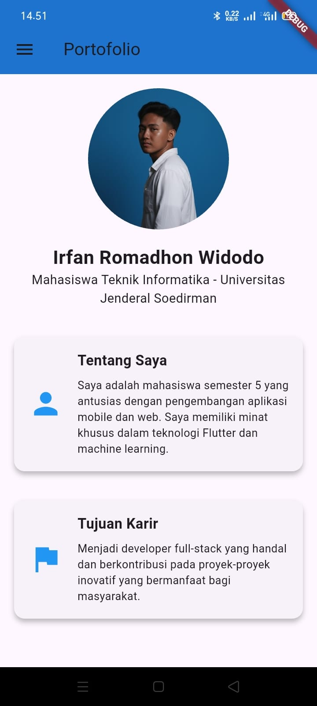
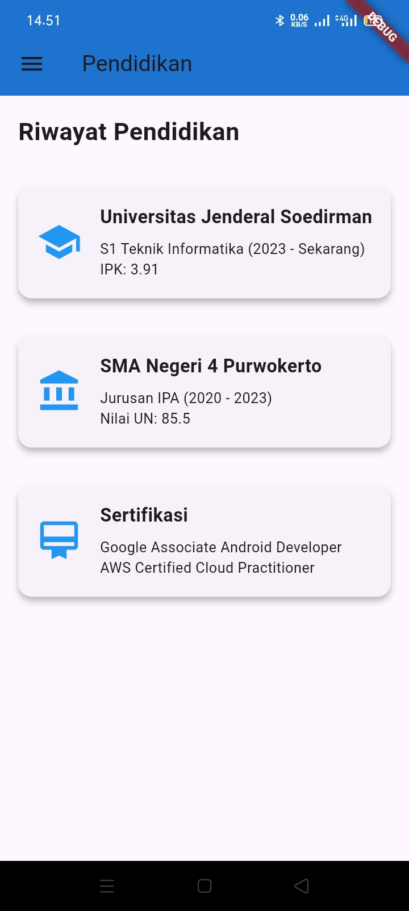
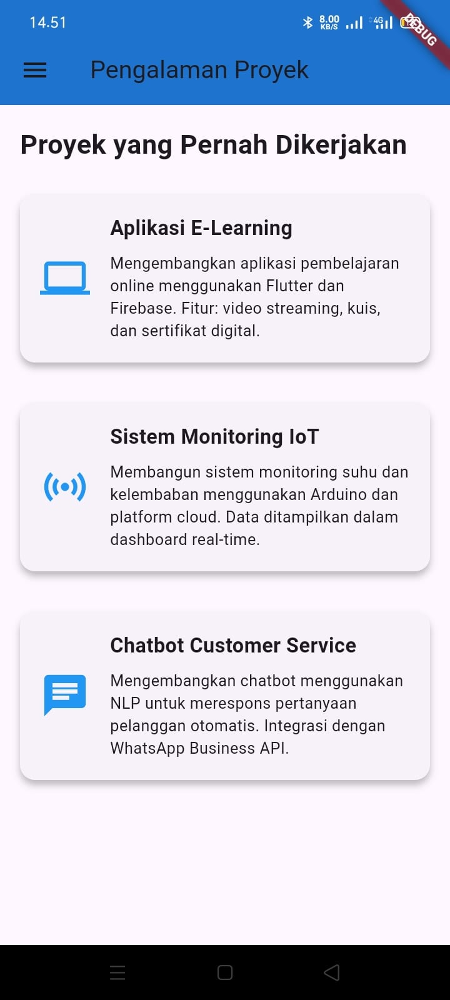
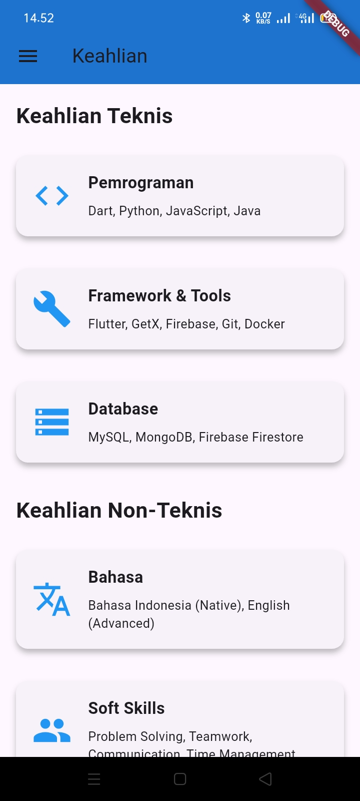
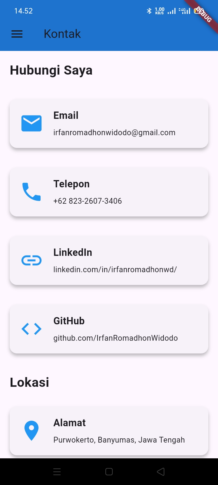
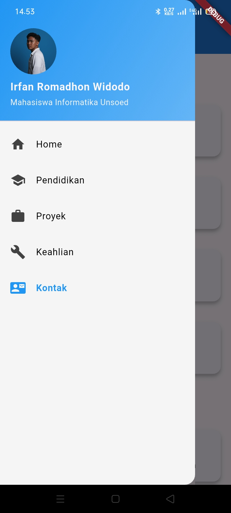

# 👨‍💻 Irfan Romadhon Widodo — H1D023023  
### Universitas Jenderal Soedirman

---

# 🧩 Aplikasi Portofolio Pribadi

Proyek ini adalah aplikasi **Portofolio Pribadi** berbasis Flutter yang menampilkan profil, pendidikan, keterampilan, proyek, dan kontak.  
Struktur folder aplikasi diatur menggunakan **GetX Architecture**, agar modular dan mudah dikembangkan.

---

## 📁 Struktur Folder

```plaintext
lib/
├── main.dart
├── app/
│   ├── routes/
│   │   └── app_pages.dart
│   ├── modules/
│   │   ├── contact/
│   │   │   ├── contact_binding.dart
│   │   │   └── contact_view.dart
│   │   ├── education/
│   │   │   ├── education_binding.dart
│   │   │   └── education_view.dart
│   │   ├── home/
│   │   │   ├── home_binding.dart
│   │   │   └── home_view.dart
│   │   ├── projects/
│   │   │   ├── projects_binding.dart
│   │   │   └── projects_view.dart
│   │   └── skills/
│   │       ├── skills_binding.dart
│   │       └── skills_view.dart
│   └── utils/
│       └── app_colors.dart
└── widgets/
    └── custom_card.dart


---

## 🧠 Penjelasan Singkat

- **main.dart** → Entry point aplikasi.  
- **app/routes/app_pages.dart** → Konfigurasi rute navigasi dengan GetX.  
- **modules/** → Berisi modul setiap halaman (Home, Contact, Education, Projects, Skills).  
- **utils/app_colors.dart** → Menyimpan konstanta warna aplikasi.  
- **widgets/custom_card.dart** → Widget kartu kustom yang digunakan di berbagai halaman.  

---

## 🖼️ Tampilan Aplikasi

| Image1 | Image2 | Image3 |
|:------:|:------:|:------:|
|  |  |  |

| Image4 | Image5 | Image6 |
|:------:|:------:|:------:|
|  |  |  |

---

## ⚙️ Teknologi yang Digunakan

- **Flutter**  
- **Dart**  
- **GetX (State Management & Routing)**  

---

## ✍️ Pengembang

**Irfan Romadhon Widodo**  
Universitas Jenderal Soedirman  
📧 Email: *[tambahkan_email_kamu_di_sini]*

---

> 💡 *Project ini dibuat untuk menampilkan portofolio pribadi dalam format aplikasi mobile yang interaktif dan modern.*
